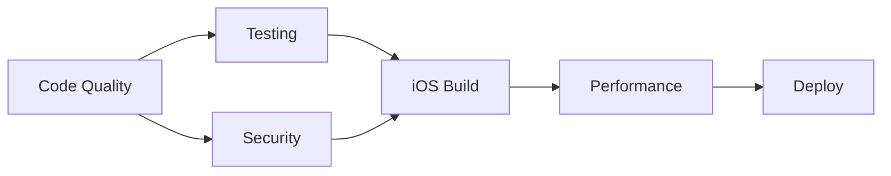

# 🚀 CI/CD Workflows Documentation

This directory contains the complete CI/CD pipeline for the OnDeviceAI React Native application, providing automated testing, security scanning, building, and deployment capabilities.

## 📁 Workflow Files

### 🔄 Main CI/CD Pipeline
**File**: `ci.yml`
**Triggers**: Push to main/develop, Pull requests
**Purpose**: Comprehensive validation pipeline



**Stages**:
1. **Code Quality**: TypeScript, ESLint, Prettier, Security audit
2. **Testing**: Unit, Integration, E2E mock tests
3. **iOS Build**: Debug and Release configurations
4. **Security**: CodeQL, OWASP dependency check
5. **Performance**: Bundle analysis, metrics
6. **Deployment**: Staging and production environments

### 📱 iOS Deployment
**File**: `ios-deploy.yml`
**Triggers**: Version tags, Manual dispatch
**Purpose**: Production iOS app deployment

**Features**:
- **Multi-target Deployment**: TestFlight, App Store, Ad-hoc
- **Code Signing**: Automated certificate management
- **Build Validation**: Pre-deployment testing
- **Artifact Management**: IPA and archive handling

### 🎉 Release Management
**File**: `release.yml`
**Triggers**: Manual dispatch with version type
**Purpose**: Automated version management and releases

**Capabilities**:
- **Semantic Versioning**: Major, minor, patch, prerelease
- **Changelog Generation**: Automated release notes
- **Tag Management**: Git tag creation and management
- **iOS Deployment**: Automatic deployment triggering

### 🔒 Security & Compliance
**File**: `security.yml`
**Triggers**: Push, PR, Daily schedule, Manual dispatch
**Purpose**: Comprehensive security analysis

**Scans**:
- **Dependencies**: OWASP vulnerability detection
- **Secrets**: Credential leak prevention
- **Code Analysis**: Static security analysis
- **Compliance**: License and privacy checks

---

## 🔧 Setup Instructions

### 1. 🔑 Configure Secrets
Add these secrets to your GitHub repository settings:

```yaml
# Apple Developer Secrets
APPLE_ID: your-apple-id@example.com
APP_STORE_CONNECT_TEAM_ID: XXXXXXXXXX
DEVELOPER_TEAM_ID: XXXXXXXXXX
MATCH_PASSWORD: your-match-password
APPLE_APP_SPECIFIC_PASSWORD: xxxx-xxxx-xxxx-xxxx

# Optional: Notification integrations
SLACK_WEBHOOK_URL: https://hooks.slack.com/...
DISCORD_WEBHOOK_URL: https://discord.com/api/webhooks/...
```

### 2. 🎯 Configure Environments
Create GitHub environments for deployment:

- **staging**: Development/testing environment
- **production**: Live production environment

### 3. 📱 iOS Configuration
Ensure your iOS project has:

```
ios/
├── OnDeviceAI.xcworkspace
├── OnDeviceAI/
│   ├── Info.plist
│   └── OnDeviceAI.entitlements
├── Podfile
└── exportOptions.plist
```

### 4. 🔧 Project Configuration
Verify these files exist:

```
.
├── package.json (with correct version)
├── bun.lockb (dependencies locked)
├── tsconfig.json (TypeScript config)
├── .eslintrc.js (Linting rules)
└── .prettierrc (Code formatting)
```

---

## 🎮 Usage Guide

### 🚀 Triggering Workflows

#### Automatic Triggers
- **Push to main/develop**: Runs full CI/CD pipeline
- **Pull Request**: Runs validation and testing
- **Daily at 2 AM UTC**: Security scans
- **Version tag push**: Automatic iOS deployment

#### Manual Triggers
1. **Go to Actions tab** in GitHub
2. **Select workflow** to run
3. **Click "Run workflow"**
4. **Configure options** as needed

### 📱 iOS Deployment Process

#### TestFlight Deployment
1. Navigate to Actions → iOS Deployment
2. Click "Run workflow"
3. Select:
   - **Deployment type**: `testflight`
   - **Build number**: Auto or manual
   - **Skip tests**: Usually `false`
4. Monitor progress in Actions tab

#### App Store Deployment
1. Ensure you're on `main` branch
2. Follow TestFlight process but select `appstore`
3. **Additional approval** may be required

### 🎉 Creating Releases

#### Automated Release Process
1. Navigate to Actions → Release Management
2. Click "Run workflow"
3. Select:
   - **Release type**: `patch`, `minor`, `major`, `beta`
   - **Release notes**: Optional additional notes
   - **Skip iOS deploy**: Usually `false`
4. The workflow will:
   - Bump version in all files
   - Generate changelog
   - Create GitHub release
   - Trigger iOS deployment

#### Manual Release Creation
1. Ensure all changes are merged to `main`
2. Tag your release: `git tag v1.0.0`
3. Push tag: `git push origin v1.0.0`
4. GitHub release and iOS deployment will trigger automatically

---

## 📊 Monitoring & Debugging

### 🔍 Workflow Status
Monitor workflow status via:
- **GitHub Actions tab**: Real-time progress
- **Email notifications**: Failure alerts
- **Slack/Discord**: Configure webhooks for team updates

### 🐛 Common Issues & Solutions

#### Build Failures
```bash
# Check logs for:
- TypeScript errors
- Test failures
- Missing dependencies
- Certificate issues
```

#### iOS Code Signing Issues
```bash
# Verify:
- Secrets are correctly configured
- Certificates are not expired
- Bundle identifier matches
- Team ID is correct
```

#### Security Scan Failures
```bash
# Common causes:
- New vulnerabilities in dependencies
- Secrets accidentally committed
- License compliance issues
```

### 📈 Performance Monitoring
Each workflow generates artifacts including:
- **Build reports**: Success/failure details
- **Test results**: Coverage and results
- **Security reports**: Vulnerability findings
- **Performance metrics**: Bundle size, timing

---

## 🔧 Customization

### 🎛️ Workflow Configuration
Modify workflow behavior by editing:

```yaml
# Environment variables
env:
  NODE_VERSION: '20'
  XCODE_VERSION: '15.2'
  
# Trigger conditions
on:
  push:
    branches: [ main, develop, feature/* ]
```

### 🔒 Security Configuration
Customize security scans:

```yaml
# Add/remove scan types
scan_type:
  - comprehensive
  - dependencies
  - secrets
  - code_analysis
  - compliance
```

### 📱 iOS Build Options
Modify iOS deployment:

```yaml
# Deployment targets
deployment_type:
  - testflight
  - appstore
  - adhoc
```

---

## 🎯 Best Practices

### 🔄 Development Workflow
1. **Feature Development**: Work in feature branches
2. **Pull Requests**: Always use PRs for code review
3. **Testing**: Ensure tests pass before merging
4. **Security**: Address security scan findings
5. **Releases**: Use semantic versioning

### 🚀 Deployment Strategy
1. **Staging First**: Always deploy to staging
2. **Testing**: Comprehensive testing before production
3. **Rollback Plan**: Always have a rollback strategy
4. **Monitoring**: Monitor deployments closely
5. **Communication**: Inform team of deployments

### 🔒 Security Practices
1. **Regular Scans**: Don't ignore security warnings
2. **Dependency Updates**: Keep dependencies updated
3. **Secret Management**: Never commit secrets
4. **Access Control**: Limit deployment permissions
5. **Audit Trail**: Maintain deployment logs

---

## 📋 Troubleshooting

### ❌ Workflow Failures

#### TypeScript Errors
```bash
# Fix by:
1. Running `bun run tsc --noEmit` locally
2. Fixing type errors
3. Pushing fixes
```

#### Test Failures
```bash
# Debug by:
1. Running tests locally: `bun test`
2. Checking test logs in Actions
3. Fixing failing tests
```

#### iOS Build Issues
```bash
# Common solutions:
1. Update Xcode version in workflow
2. Verify iOS dependencies
3. Check code signing configuration
4. Update iOS deployment target
```

#### Security Scan Issues
```bash
# Address by:
1. Reviewing security report artifacts
2. Updating vulnerable dependencies
3. Removing any exposed secrets
4. Fixing license compliance issues
```

### 🔧 Performance Issues
If workflows are slow:
1. **Check cache usage**: Ensure caching is working
2. **Parallel execution**: Verify jobs run in parallel
3. **Resource limits**: Consider upgrading runners
4. **Dependency optimization**: Remove unused dependencies

---

## 📚 Additional Resources

### 📖 Documentation
- [GitHub Actions Documentation](https://docs.github.com/en/actions)
- [React Native CI/CD Best Practices](https://reactnative.dev/docs/publishing-to-app-store)
- [iOS Code Signing Guide](https://developer.apple.com/documentation/xcode/code_signing)

### 🛠️ Tools
- [Fastlane](https://fastlane.tools/): iOS deployment automation
- [CodeQL](https://codeql.github.com/): Security analysis
- [OWASP Dependency Check](https://owasp.org/www-project-dependency-check/): Vulnerability scanning

### 🤝 Support
For workflow issues:
1. Check this documentation
2. Review workflow logs
3. Search existing GitHub issues
4. Create new issue with detailed logs

---

*Last updated: $(date +'%Y-%m-%d')*