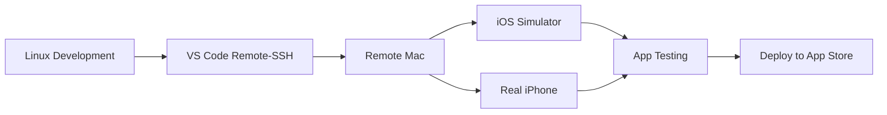

# 🍎 Remote macOS Deployment Guide

**Complete solution for developing OnDeviceAI on remote macOS from your Linux environment**

## 🎯 Quick Start

1. **Get Remote macOS Access** (choose one):
   - **MacStadium** (recommended): Professional Mac hosting
   - **Mac-in-Cloud**: Affordable cloud Mac instances  
   - **AWS EC2 Mac**: Enterprise-grade Mac instances
   - **Local Mac**: Physical Mac with remote access enabled

2. **Deploy Your Project**:
   ```bash
   # Configure SSH (see ssh-config-template)
   # Then deploy in one command:
   ./deploy-to-remote-mac.sh your-mac-host
   ```

3. **Connect & Develop**:
   - Open VS Code → Remote-SSH → Connect to Host
   - Terminal 1: `bun start`
   - Terminal 2: `bun run ios:iphone16pro`

## 📁 What's Included

```
📦 Remote macOS Development Package
├── 📄 dev-remote-mac.md              # Complete setup guide
├── 🔧 setup-remote-dev.sh            # macOS environment setup
├── 📱 connect-usb-device.sh          # USB iPhone forwarding
├── 🚀 deploy-to-remote-mac.sh        # One-click deployment
├── ⚙️  vscode-remote-settings.json    # Optimized VS Code config
├── 🔑 ssh-config-template            # SSH configuration examples
└── 📚 remote-development-guide.md    # Comprehensive documentation
```

## 🛠 Features

### ✅ Complete iOS Development Environment
- **Xcode + iOS Simulator**: Full native iOS development
- **TurboModule Support**: Speech recognition, calendar integration
- **iPhone 16 Pro Optimization**: A18 Pro specific optimizations
- **New Architecture**: React Native 0.79.2 with Fabric renderer

### ✅ Professional Development Workflow
- **VS Code Remote-SSH**: Seamless remote development
- **Hot Reload**: Instant code changes
- **USB Forwarding**: Test on real iPhone from Linux
- **Screen Sharing**: Visual debugging via VNC

### ✅ One-Click Deployment
- **Automated Setup**: Complete environment configuration
- **Dependency Management**: Handles all iOS/macOS dependencies
- **Build Validation**: Ensures everything works before development

## 🚀 Step-by-Step Instructions

### 1. Choose Remote Mac Provider

| Provider | Cost | Performance | Setup Time |
|----------|------|-------------|------------|
| **MacStadium** | $$$ | Excellent | 30 mins |
| **Mac-in-Cloud** | $$ | Good | 15 mins |
| **AWS EC2 Mac** | $$$$ | Excellent | 45 mins |
| **Local Mac** | Free | Varies | 10 mins |

### 2. Configure SSH Access

```bash
# Copy our template
cp ssh-config-template ~/.ssh/config

# Edit with your details
vim ~/.ssh/config

# Test connection
ssh your-mac-host
```

### 3. Deploy Project

```bash
# One-command deployment
./deploy-to-remote-mac.sh your-mac-host

# Or step by step:
./setup-remote-dev.sh  # Run on remote Mac
# Then sync files manually
```

### 4. Connect via VS Code

1. Install **Remote-SSH** extension
2. `Ctrl+Shift+P` → "Remote-SSH: Connect to Host"
3. Select your configured Mac host
4. Open project folder: `~/Development/ondeviceai`

### 5. Start Development

```bash
# Terminal 1: Start Metro bundler
bun start

# Terminal 2: Launch iOS app
bun run ios:iphone16pro

# Terminal 3: Watch logs (optional)
xcrun simctl spawn booted log stream --predicate 'process == "OnDeviceAI"'
```

## 📱 iPhone Development

### Connect Real iPhone from Linux

```bash
# On Linux: Find your iPhone
usbip list -l

# Connect iPhone to remote Mac
./connect-usb-device.sh 1-1

# On remote Mac: Attach device
sudo usbip attach -r YOUR_LINUX_IP -b 1-1

# Verify connection
idevice_id -l
```

## 🎯 OnDeviceAI Specific Features

### TurboModules Ready
- ✅ **Speech Recognition**: Native iOS Speech Framework
- ✅ **Calendar Integration**: EventKit with Expo fallback  
- ✅ **Performance Monitoring**: A18 Pro optimizations
- ✅ **Codegen**: Automatic native interface generation

### iPhone 16 Pro Optimized
- ✅ **A18 Pro Performance**: Hardware-specific optimizations
- ✅ **ProMotion Display**: 120Hz adaptive refresh rate
- ✅ **Advanced Camera**: Latest camera API integration
- ✅ **iOS 18.5**: Latest iOS feature support

## 💡 Pro Tips

1. **Use tmux** on remote Mac for persistent sessions
2. **Enable SSH key forwarding** for seamless Git access
3. **Set up VNC** for visual debugging and UI work
4. **Use watchman** for faster file watching
5. **Keep Xcode updated** for latest simulator support

## 🆘 Troubleshooting

### Common Issues & Solutions

**SSH Connection Fails**:
```bash
# Check SSH config
ssh -v your-mac-host

# Test basic connection
ping your-mac-host.com
```

**Pods Installation Fails**:
```bash
cd ios && rm -rf Pods Podfile.lock
RCT_NEW_ARCH_ENABLED=1 bundle exec pod install
```

**iPhone Not Detected**:
```bash
# Linux side
sudo systemctl restart usbipd

# Mac side  
brew reinstall usbip
```

**Simulator Won't Launch**:
```bash
sudo xcode-select -s /Applications/Xcode.app/Contents/Developer
xcrun simctl shutdown all
xcrun simctl boot "iPhone 16 Pro"
```

## 📊 Development Workflow



## 🎉 Success Metrics

After setup, you should have:
- ✅ VS Code connected to remote Mac
- ✅ iOS Simulator running iPhone 16 Pro  
- ✅ Hot reload working on file save
- ✅ TurboModules functional and tested
- ✅ Physical iPhone connected (optional)
- ✅ Build pipeline ready for App Store

---

**Ready to develop native iOS apps with full TurboModule support from your Linux machine!** 🚀

For support, check the troubleshooting section or refer to the comprehensive guide in `remote-development-guide.md`.